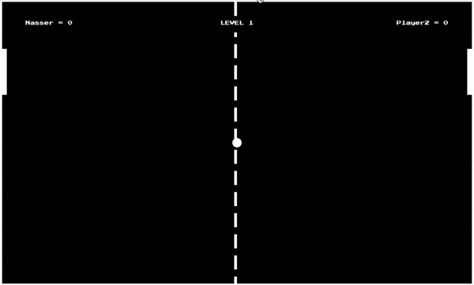

# PongGame
Remember the arcade video games? Here is **pong**, one of the earliest arcade video games. a simple two dimensional table tennis game.
[more about the game](https://en.wikipedia.org/wiki/Pong)

In this game, each level consits of 3 points, on scoring them you go to the next level where the ball speed increase and paddle height decrease. If the computer scores 3 points against you in any level then the game is over, your score is stored and added to the scores table.
At any time, you can **pause/play the game**, **change playground color** or **change the ball speed**.

This game is built using HTML5 canvas, JavaScript and firebase to store players' scores.

## Live Demo
Just to try to play a game https://nasserahmed009.github.io/PongGame/

